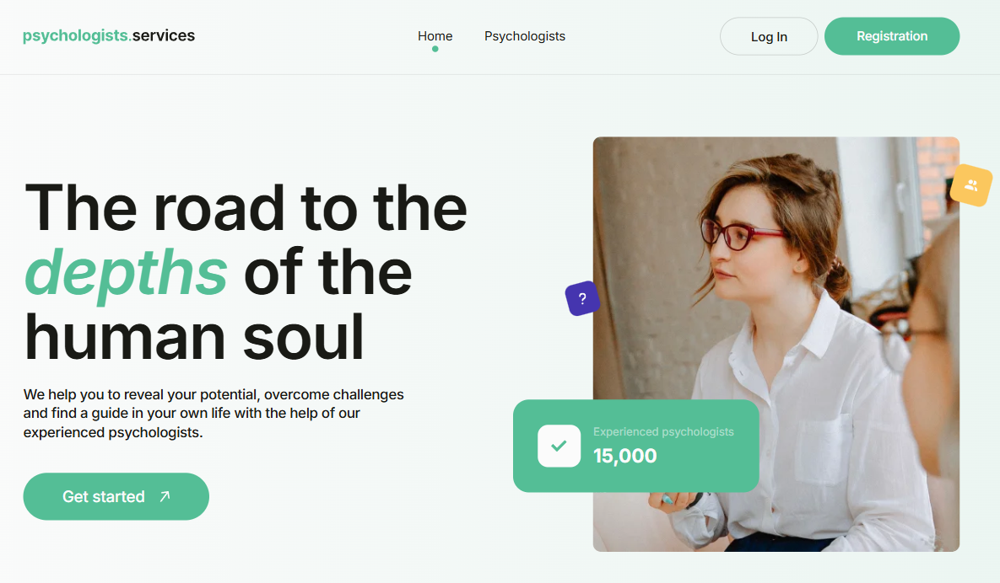
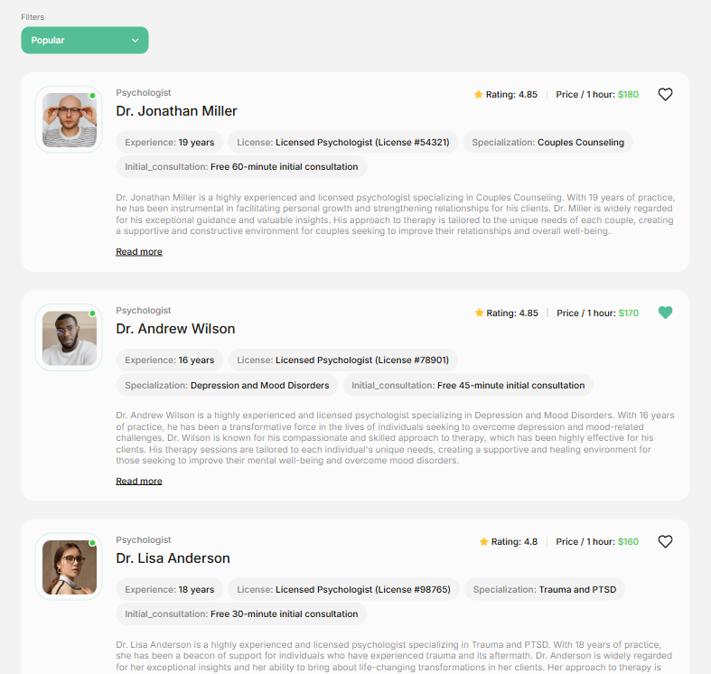
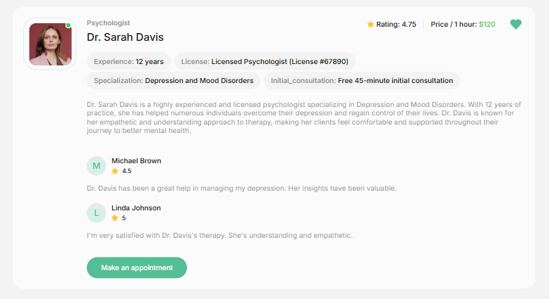
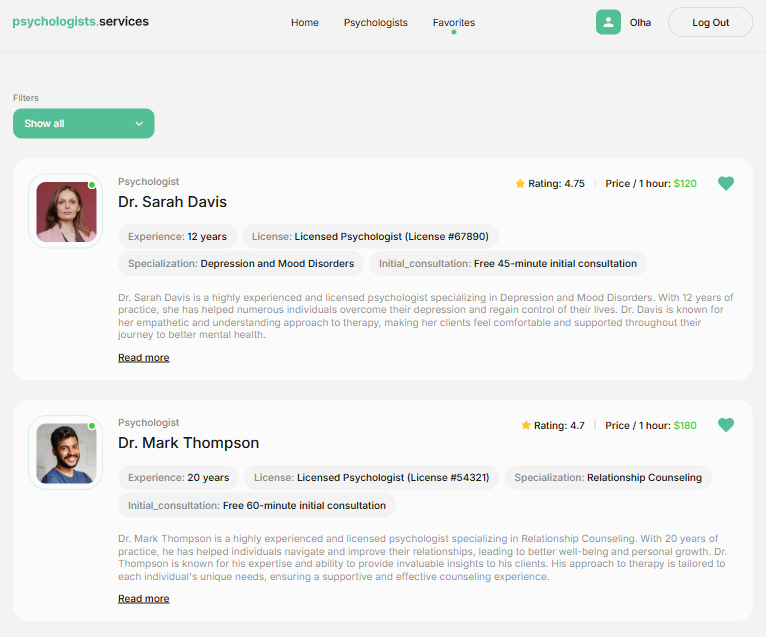
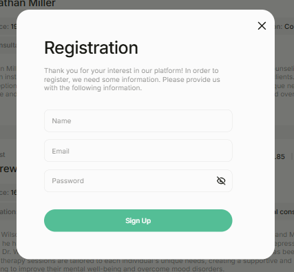
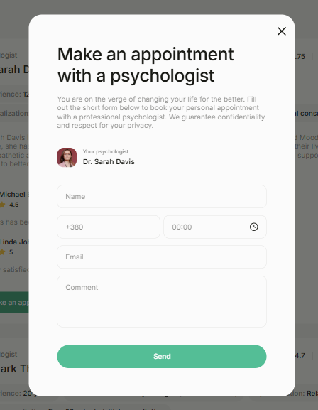
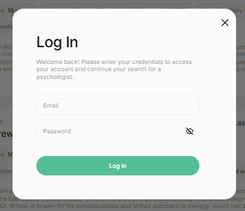

# 🧠 Psychologists Services

<p align="center">
  
</p>

---

## 📖 About the Project

**🌐 Live Page:** View Project

**Psychologists Services** is a web application created for a company that provides psychological services.

The application allows users to browse available psychologists, sort them by different criteria, view detailed information about specialists, save psychologists to favorites, and submit a request for a personal appointment.

The project also includes user authentication and a protected Favorites page available to authenticated users.

---

## ✨ Features

**🏠 Home Page**

<p>
  
</p>

- Introduction to the psychological services.
- Hero section with the company's slogan.
- Call-to-action button leading to the psychologists catalog.
- Responsive layout for different screen sizes.

---

**🧠 Psychologists Page**

<p>
  
</p>

- Display psychologists loaded from Firebase Realtime Database.
- Three psychologist cards are displayed initially.
- Load additional psychologists using the Load more button.
- Sort psychologists by:
  - A to Z.
  - Z to A.
  - Lowest price.
  - Highest price.
  - Lowest rating.
  - Highest rating.
- Display an empty state when no psychologists match the selected criteria.

---

**👩‍⚕️ Psychologist Cards**

<p>
  
</p>

- Each card provides information about the psychologist, including:
  - Name and avatar.
  - Experience.
  - Number of reviews.
  - Rating.
  - Price per hour.
  - License.
  - Specialization.
  - Initial consultation information.
  - About section.
- The Read more button expands the card and displays additional information, including client reviews.

---

**❤️ Favorites**

<p>
  
</p>

- Add psychologists to favorites.
- Remove psychologists from favorites.
- Visual indication of selected psychologists.
- Preserve the selected state after page refresh.
- Protected Favorites page available only to authenticated users.
- Display favorite psychologists using the same card layout as the main catalog.

---

**🔐 Authentication**

<p>
  
</p>

- User authentication is implemented with Firebase Authentication.
- Users can:
  - Register an account.
  - Log in.
  - Log out.
- Retrieve the current authenticated user.
- Access protected application features.
- Authentication forms include:
  - Required field validation.
  - Validation error messages.
  - Password visibility toggle.
  - Success and error toast notifications.

  ---

**📅 Appointment Form**

<p>
  
</p>

- Users can submit an appointment request for a psychologist.
- The form includes:
  - Name.
  - Phone number.
  - Appointment time.
  - Email.
  - Additional comment.
- The form provides:
  - Required field validation.
  - Validation error messages.
  - Success notification after submitting the request.
  - Automatic closing of the modal after successful submission.

  ---

**🪟 Modal Windows**

<p>
  
</p>

- Modal windows are used for authentication and appointment forms.
- They can be closed by:
  - Clicking the close button.
  - Clicking the backdrop.
  - Pressing the Esc key.

  ---

**🎨 Interface**

- Responsive layout from 320px to 1440px.
- Mobile-first approach.
- Semantic HTML.
- Reusable React components.
- Custom styling based on the provided design.
- Hover and focus states for interactive elements.
- Toast notifications.
- Responsive navigation and content layout.

---

**🔥 Firebase**

Firebase is used as the backend service for the application.

- Firebase Authentication handles:
  - User registration.
  - User login.
  - Current user state.
  - User logout.
- The Realtime Database stores psychologist information, including:
  - name
  - avatar_url
  - experience
  - reviews
  - price_per_hour
  - rating
  - license
  - specialization
  - initial_consultation
  - about
- Firebase Security Rules are configured to control access to application data.

---

## 🛠 Tech Stack

[](https://skillicons.dev)

| Technology                     | Purpose                                    |
| :----------------------------- | :----------------------------------------- |
| **React**                      | User interface development                 |
| **TypeScript**                 | Type safety and improved code reliability  |
| **Vite**                       | Development environment and build tool     |
| **React Router**               | Client-side routing                        |
| **Firebase Authentication**    | User authentication                        |
| **Firebase Realtime Database** | Storing and retrieving psychologist data   |
| **React Hook Form**            | Form state management                      |
| **Yup**                        | Form validation                            |
| **React Toastify**             | Toast notifications                        |
| **CSS Modules**                | Component-scoped styling                   |
| **Modern Normalize**           | Consistent default browser styling         |
| **SVG Sprite**                 | Reusable interface icons                   |
| **Git & GitHub**               | Version control and source code management |

---

## 📱 Responsive Design

The application is designed to work across different screen sizes:

- 📱 Mobile — from 320px.
- 📱 Tablet — from 768px.
- 💻 Desktop — up to 1312px.

The layout adapts to different viewport sizes while maintaining usability and visual consistency.

---

## 🎯 Project Highlights

- 🔐 Firebase Authentication with protected routes.
- 🔥 Firebase Realtime Database integration.
- ❤️ Persistent favorites functionality.
- 🔎 Psychologist sorting and filtering.
- 📚 Progressive loading with the Load more functionality.
- 📝 Form validation with React Hook Form and Yup.
- 🪟 Reusable modal components with keyboard and backdrop controls.
- 📱 Responsive mobile-first interface.
- 🧩 Reusable and component-based architecture.
- ⚡ Built with React, TypeScript, and Vite.

---

## 🚀 Installation and Running

**1. Clone the repository**

```bash
git clone https://github.com/OlhaBorzhynska/psychologists-services.git
```

**2. Navigate to the project folder**

```bash
cd psychologists-services
```

**3. Install dependencies**

```bash
npm install
```

**4. Run the project in development mode**

```bash
npm run dev
```

**5. Open the application in your browser:**

```bash
http://localhost:5173
```

---

## 👩‍💻 Author

**Olha Borzhynska** - Junior Full-Stack Developer

GitHub: https://github.com/OlhaBorzhynska

LinkedIn: www.linkedin.com/in/olha-borzhynska

Email: mykytlo@gmail.com
